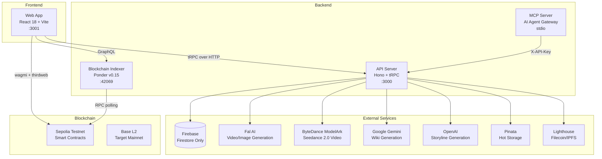
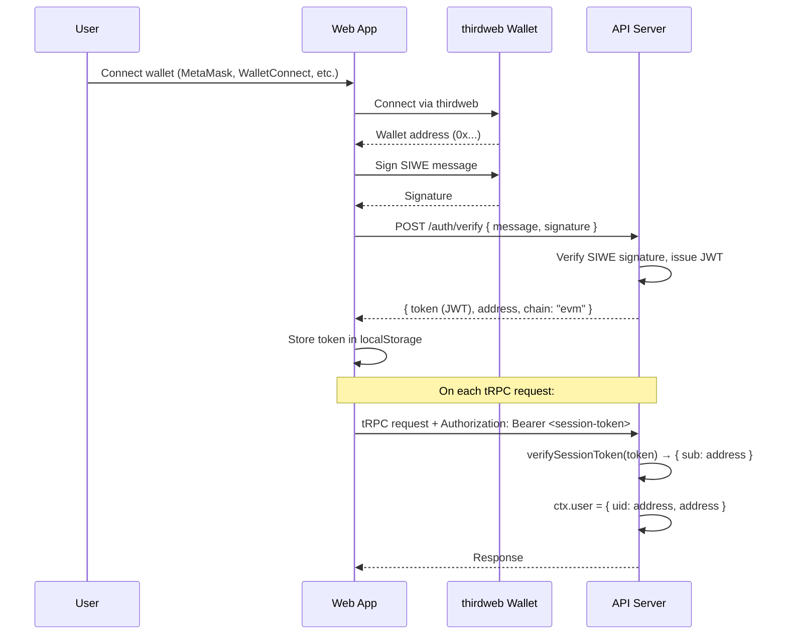

# Architecture

## System Overview



### Agent Systems

LOAR supports two agent systems with programmatic access:

| System                 | Type       | Description                                           |
| ---------------------- | ---------- | ----------------------------------------------------- |
| **Talent Agents**      | Human      | Represent creators, broker deals, earn commissions    |
| **AI Agent Pipelines** | Autonomous | Multi-step content creation and universe management   |
| **API Keys**           | Auth       | Programmatic access via `X-API-Key` header            |
| **MCP Server**         | Gateway    | Exposes LOAR as 25 tools for MCP-compatible AI agents |

See [docs/agents.md](agents.md) for full documentation.

## Authentication Flow



### Key Auth Files

| File                              | Role                                                    |
| --------------------------------- | ------------------------------------------------------- |
| `apps/web/src/lib/wallet-auth.ts` | `useWalletAuth()` hook — SIWE sign-in/sign-out          |
| `apps/web/src/utils/trpc.ts`      | Attaches Bearer token to tRPC requests                  |
| `apps/server/src/lib/siwe.ts`     | SIWE message verification, JWT signing/verification     |
| `apps/server/src/lib/auth.ts`     | `verifyAuth()` — supports SIWE JWT + API key auth       |
| `apps/server/src/lib/apiKeys.ts`  | API key generation, verification, rate limiting         |
| `apps/server/src/lib/context.ts`  | `createContext()` — sets `ctx.user` from verified token |
| `apps/server/src/lib/firebase.ts` | Firebase Admin SDK init (exports `db` — Firestore only) |
| `apps/server/src/lib/trpc.ts`     | Defines `publicProcedure` and `protectedProcedure`      |

### Access Control

- **`publicProcedure`** — No authentication required. Used for read-only queries.
- **`protectedProcedure`** — Requires SIWE JWT or valid API key. Rejects with UNAUTHORIZED if `ctx.user` is null.
- **API Key auth** — `X-API-Key: loar_...` header. Keys are SHA-256 hashed, rate-limited, and scoped with permissions. See `apps/server/src/lib/apiKeys.ts`.

## Server Architecture

**Entry point:** `apps/server/src/index.ts`

The server uses [Hono](https://hono.dev/) as the HTTP framework with middleware:

1. **Logger** — Request/response logging
2. **CORS** — Origin restricted to `CORS_ORIGIN` env var
3. **Image routes** — `GET /images/*` serves stored images
4. **Filecoin route** — `GET /api/filecoin/:pieceCid` streams content from Filecoin/Synapse
5. **tRPC** — `POST /trpc/*` handles all tRPC procedures
6. **Health** — `GET /` returns "OK", `GET /health` returns JSON status

### tRPC Router Tree

```
appRouter (44 routers, 400+ procedures)
├── healthCheck              (query, public)
├── privateData              (query, protected)
├── admin                    (sub-router) — platform configuration
├── ads                      (sub-router) — ad slots and sponsorships
├── aiAgents                 (sub-router) — AI agent management
├── aiPipelines              (sub-router) — AI agent pipeline execution
├── analytics                (sub-router) — views, engagement, trending
├── apiKeys                  (sub-router) — API key management
├── bounties                 (sub-router) — story bounties
├── collabs                  (sub-router) — cross-universe collaborations
├── content                  (sub-router) — user content, wiki/lore generation
├── contentLicensing         (sub-router) — content licensing deals
├── credits                  (sub-router) — credit packages and balances
├── entities                 (sub-router) — characters, locations, items (10+ kinds)
├── feed                     (sub-router) — content feed
├── gallery                  (sub-router) — universe galleries
├── generation               (sub-router) — AI video with smart routing + billing
├── governance               (sub-router) — governance queries
├── licensing                (sub-router) — IP licensing and royalties
├── listings                 (sub-router) — content listings
├── marketplace              (sub-router) — canon submissions, voting
├── media                    (sub-router) — media management
├── moderation               (sub-router) — content moderation
├── nft                      (sub-router) — NFT minting and metadata
├── platformSubscriptions    (sub-router) — platform-level subscriptions
├── player                   (sub-router) — narrative player/gameplay
├── portfolio                (sub-router) — user portfolio
├── pricing                  (sub-router) — pricing tiers
├── privateSection           (sub-router) — private/gated content
├── profiles                 (sub-router) — user profiles and discovery
├── quests                   (sub-router) — quest system, daily check-ins, affiliates
├── revenue                  (sub-router) — revenue tracking and splits
├── sandbox                  (sub-router) — draft creations
├── social                   (sub-router) — social features
├── splits                   (sub-router) — revenue split configuration
├── staking                  (sub-router) — token staking
├── storage                  (sub-router) — decentralized storage
├── studio                   (sub-router) — entity asset pack orchestrator
├── subscriptions            (sub-router) — universe subscription tiers
├── talentAgents             (sub-router) — talent agent management
├── tokenGates               (sub-router) — token-gated content
├── tokenSocial              (sub-router) — token social features
├── universeGenConfig        (sub-router) — per-universe AI generation config
├── universes                (sub-router) — CRUD, team, treasury
├── universeTeam             (sub-router) — universe team management
└── universeTreasury         (sub-router) — treasury operations
```

### Services

| Service    | File                  | External API          | Purpose                             |
| ---------- | --------------------- | --------------------- | ----------------------------------- |
| Fal AI     | `services/fal.ts`     | fal.ai                | Image and video generation          |
| Gemini     | `services/gemini.ts`  | Google Gemini 2.5 Pro | Wiki generation from video analysis |
| MinIO\*    | `services/minio.ts`   | Firebase Storage      | File upload/download                |
| Synapse    | `services/synapse.ts` | Filecoin/Synapse      | Decentralized video storage         |
| Wikia      | `services/wikia.ts`   | OpenAI                | Storyline generation                |
| Pinata     | `services/storage/`   | Pinata                | IPFS pinning (primary hot storage)  |
| Lighthouse | `services/storage/`   | Lighthouse            | Filecoin permanent storage          |

_Note: `minio.ts` uses Firebase Storage (migrated from MinIO, filename preserved). Storage providers are managed by `StorageManager` with priority-based fallback._

## Web Architecture

**Entry point:** `apps/web/src/main.tsx`

| Layer         | Technology               | Purpose                                 |
| ------------- | ------------------------ | --------------------------------------- |
| Bundler       | Vite                     | Dev server (port 3001), build           |
| Routing       | TanStack Router          | File-based routing (`src/routes/`)      |
| Data Fetching | TanStack Query + tRPC    | Server state management                 |
| Web3          | wagmi + thirdweb         | Wallet connection, contract interaction |
| Auth          | thirdweb + SIWE          | Wallet-based authentication             |
| UI            | Tailwind CSS + shadcn/ui | Component library                       |
| Flow Editor   | ReactFlow                | Narrative node visualization            |

### Route Map

| Route                        | Description                                          |
| ---------------------------- | ---------------------------------------------------- |
| `/`                          | Home / landing page                                  |
| `/login`                     | Authentication (wallet connect)                      |
| `/dashboard`                 | User dashboard (universes, AI gen, LP yield, quests) |
| `/market`                    | Token marketplace                                    |
| `/create`                    | Create hub (universe, entities)                      |
| `/create/$kind`              | Per-kind creation form                               |
| `/cinematicUniverseCreate`   | Full universe creation wizard                        |
| `/universe/$id`              | Universe detail view                                 |
| `/universe/$id/deploy-token` | Deploy token for existing universe                   |
| `/universe/$id/gen-config`   | AI generation configuration                          |
| `/universe/$id/gallery`      | Universe gallery                                     |
| `/governance/$universeId`    | Governance voting (proposals, timelock)              |
| `/treasury/$universeId`      | Treasury management                                  |
| `/play/$universeId`          | Narrative gameplay                                   |
| `/wiki`                      | Worldbuilding encyclopedia                           |
| `/wiki/entity/$id`           | Entity detail page                                   |
| `/wiki/character/$id`        | Character detail page                                |
| `/tokens/`                   | Token dashboard                                      |
| `/tokens/$address`           | Token details                                        |
| `/tokens/portfolio`          | Token portfolio                                      |
| `/staking`                   | $LOAR staking                                        |
| `/credits`                   | Credit balance and purchase                          |
| `/sell/`                     | Content selling hub                                  |
| `/licensing/`                | IP licensing hub                                     |
| `/collabs/`                  | Collaboration hub                                    |
| `/ads/`                      | Ad management                                        |
| `/canon/$universeId`         | Canon marketplace                                    |
| `/bounties/`                 | Bounty hub                                           |
| `/agents/`                   | AI agent marketplace                                 |
| `/profile/$username`         | User profiles                                        |
| `/admin/moderation`          | Content moderation queue                             |
| `/dmca`                      | DMCA takedown form                                   |
| `/event.$universe.$event`    | Event detail within universe                         |

### Environment Variable Loading

The web app reads env vars from the root `.env` file via Vite's `envDir` config in `vite.config.ts`. Only variables prefixed with `VITE_` are exposed to the browser.

## Indexer Architecture

**Framework:** [Ponder v0.15](https://ponder.sh/)

The indexer watches Sepolia blockchain events and builds a queryable GraphQL API.

### Factory Pattern

The indexer uses Ponder's factory pattern:

1. **UniverseManager** is the root contract (fixed address)
2. When `UniverseCreated` fires, Ponder dynamically tracks the new **Universe** contract
3. When `TokenCreated` fires, Ponder tracks the new **GovernanceERC20** and **UniverseGovernor** contracts

### Indexed Data

- **Universes** — Creator, name, description, image, token/governor addresses
- **Nodes** — Narrative nodes forming a tree (previousNodeId links)
- **Tokens** — ERC20 governance tokens, transfers, holders, balances
- **Pools** — Uniswap v4 pools, swaps
- **Proposals** — Governance proposals, votes, executions, cancellations

### GraphQL API

Available at `http://localhost:42069/graphql` during development. See [docs/api.md](api.md) for query examples.
