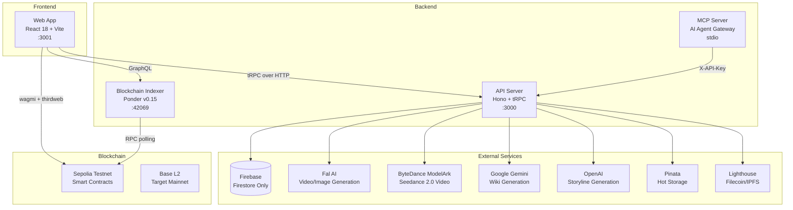
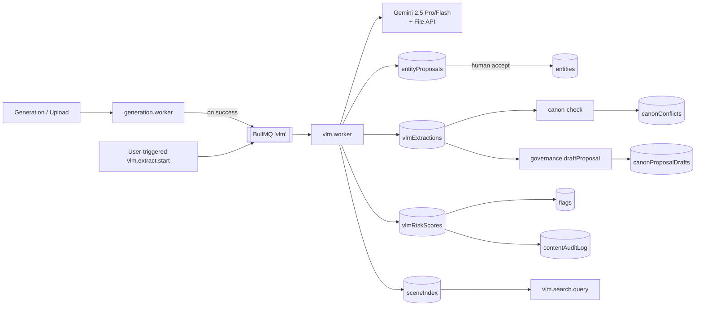
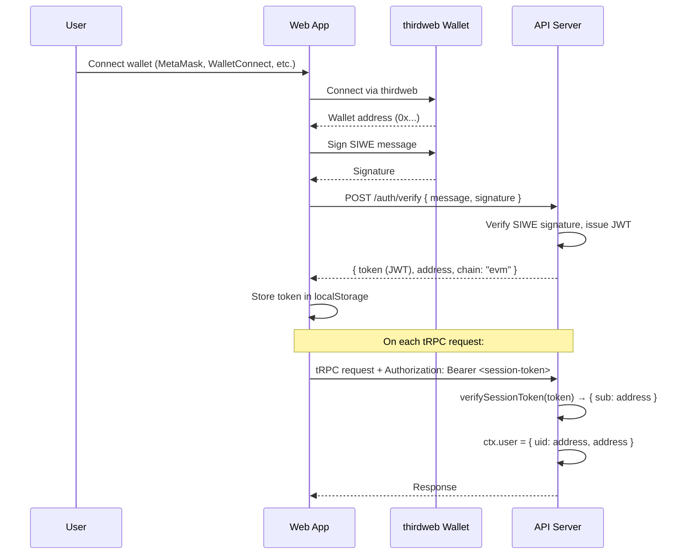

# Architecture

## System Overview



### Agent Systems

LOAR supports two agent systems with programmatic access:

| System                 | Type       | Description                                           |
| ---------------------- | ---------- | ----------------------------------------------------- |
| **Talent Agents**      | Human      | Represent creators, broker deals, earn commissions    |
| **AI Agent Pipelines** | Autonomous | Multi-step content creation and universe management   |
| **API Keys**           | Auth       | Programmatic access via `X-API-Key` header            |
| **MCP Server**         | Gateway    | Exposes LOAR as 25 tools for MCP-compatible AI agents |

See [docs/agents.md](agents.md) for full documentation.

## VLM Subsystem (Vision-Language Model intelligence)

LOAR layers a VLM pipeline over generation + upload + canon to turn passive media into structured story intelligence. Full spec: [docs/prd-vlm-subsystem.md](prd-vlm-subsystem.md).

| Capability                          | Router                                                                  | Notes                                                                                                     |
| ----------------------------------- | ----------------------------------------------------------------------- | --------------------------------------------------------------------------------------------------------- |
| **Video/image → canon**             | `vlm.extract.start` / `.status` / `.get`                                | Async Gemini 2.5 Pro extraction into `vlmExtractions/`. Populates `entityProposals` + `sceneIndex`.       |
| **Entity proposal review**          | `vlm.proposals.{list,accept,reject,merge}`                              | Human-in-loop. Accept creates a real entity via existing `createEntity`.                                  |
| **Canon consistency check**         | `vlm.canon.check` / `.getConflicts`                                     | Compares extraction vs. universe bible + entities + recent beats. Severity: info/warn/block.              |
| **Moderation risk scoring**         | `vlm.moderation.{riskScore,batchRiskScores,requeue,overrideAutoAction}` | Feeds existing `flags` / `contentAuditLog`. High-risk optionally auto-hides.                              |
| **Multimodal search**               | `vlm.search.query`                                                      | Lexical over `sceneIndex` tags+captions; optional text-embedding-004 behind `VLM_EMBEDDINGS=true`.        |
| **Generation copilot**              | `vlm.copilot.{improvePrompt,extractStyleBible,scoreOutput}`             | Reference-aware prompt coaching + output scoring + moodboard → style pack.                                |
| **Trailer / recap / SEO**           | `vlm.recap.generate`                                                    | Chapters, trailer beats, social cuts, title, SEO description, thumbnail suggestions.                      |
| **Governance canon draft**          | `vlm.governance.{draftProposal,listDrafts}`                             | Grounded proposals with timestamps + pro/con framing; voting remains the canonical governance path.       |
| **Editing graph / continuous film** | `VLM_GRAPH_NODES` (workflows) + `autoplay.*` (daemon)                   | Feature-flagged behind `VLM_CONTINUOUS_FILM=true`. Node primitives: Planner, Judge, Continuity, Stitcher. |

### Data flow



### New Firestore collections

`vlmJobs`, `vlmExtractions`, `entityProposals`, `canonConflicts`, `sceneIndex`, `vlmRiskScores`, `canonProposalDrafts`, `vlmRecaps`, `vlmCopilotScores`, `vlmAutoplayState`.

### Env vars

Server-only (never exposed to browser): `VLM_WORKER_DISABLED`, `VLM_WORKER_CONCURRENCY`, `VLM_AUTO_EXTRACT`, `VLM_AUTO_HIDE_HIGH_RISK`, `VLM_EMBEDDINGS`, `VLM_EXTRACT_PER_USER_PER_HOUR`, `VLM_USER_MONTHLY_USD`, `VLM_CROSS_MODEL`, `CANON_BLOCK_ON_HIGH`, `VLM_CONTINUOUS_FILM`, `VLM_AUTOPLAY_MAX_PER_DAY`, `VLM_AUTOPLAY_BUDGET_USD`, `VLM_AUTOPLAY_REQUIRE_VOTE`. See `.env.example`.

### Frontend surfaces

| Path                                                                                                 | Role                                              |
| ---------------------------------------------------------------------------------------------------- | ------------------------------------------------- |
| [`/extract/$jobId`](../apps/web/src/routes/extract.$jobId.tsx)                                       | Poll + render a VLM extraction job                |
| [`/search`](../apps/web/src/routes/search.tsx)                                                       | Multimodal scene search                           |
| [`components/vlm/ExtractionReview.tsx`](../apps/web/src/components/vlm/ExtractionReview.tsx)         | Inline review panel for extractions               |
| [`components/vlm/CanonValidatorBanner.tsx`](../apps/web/src/components/vlm/CanonValidatorBanner.tsx) | Pre-publish consistency banner                    |
| [`components/vlm/RiskBadge.tsx`](../apps/web/src/components/vlm/RiskBadge.tsx)                       | Compact risk chip for content cards + admin queue |

## Cost Tracker & Controls

Admin-only cost attribution layer. Every paid provider call (Fal, ByteDance, Gemini, OpenAI, Meshy, ElevenLabs, Lighthouse) goes through `services/cost-tracker/` which records the USD cost, tags it to a user + universe + job, and aggregates it for the `/admin/cost` dashboard.

| Module                               | Purpose                                                                              |
| ------------------------------------ | ------------------------------------------------------------------------------------ |
| `cost-tracker/record.ts`             | Single entry point — called from every provider adapter after billing.               |
| `cost-tracker/controls.ts`           | Hard daily platform cap + margin target. Read-through cache with admin invalidation. |
| `cost-tracker/alerts.ts`             | Background sweep — Slack + email when margin or cap breached.                        |
| `cost-tracker/top-movers.ts`         | Biggest week-over-week cost shifts by provider and model.                            |
| `cost-tracker/by-model.ts`           | Cost vs. revenue per model; surfaces negative-margin models.                         |
| `cost-tracker/comparison.ts`         | Cost-per-output comparison across providers for the same modality.                   |
| `cost-tracker/trend.ts`              | Daily cost + margin time series for the dashboard chart.                             |
| `cost-tracker/csv-export.ts`         | Admin export for accounting / reconciliation.                                        |
| `jobs/cost-alerts.ts`                | Cron driver for the alert sweep (enable on **ONE replica only**).                    |
| `routers/admin/cost.routes.ts`       | Admin-only tRPC router — dashboard queries + controls mutations.                     |
| `routes/admin-cost.ts`               | Hono HTTP route: CSV export endpoint (admin-only, same auth middleware).             |
| `apps/web/src/routes/admin/cost.tsx` | Admin dashboard: margin gauges, top movers, by-model breakdown, CSV export.          |

Hard cap behaviour: when today's platform spend reaches `COST_DAILY_PLATFORM_CAP_USD`, every paid provider call fails fast with `CostCapExceededError` until day rollover or an admin raises the cap via `admin.cost.controls.update`.

## ERC-4337 Paymaster (Gas Sponsorship)

Meta-transaction sponsorship for user actions (mint, vote, universe creation). Lets new users take on-chain actions without holding gas. See [apps/server/src/routes/paymaster.ts](../apps/server/src/routes/paymaster.ts).

- **Provider resolution** (first match wins): `THIRDWEB_SECRET_KEY` → `PIMLICO_API_KEY` → `BICONOMY_API_KEY`. When none set, `/api/paymaster` returns 501.
- **Endpoints**: `POST /api/paymaster/sponsorUserOp`, `POST /api/paymaster/getUserOperationGasPrice`, `POST /api/paymaster/estimateUserOperationGas`.
- **Quota**: `PAYMASTER_DAILY_LIMIT` sponsored ops per wallet per rolling 24h window.
- **Frontend**: [apps/web/src/hooks/useSponsoredTransaction.ts](../apps/web/src/hooks/useSponsoredTransaction.ts) falls back to user-paid gas when sponsorship is unavailable.

## Webhooks

Outbound webhook delivery for external integrations (agents, partner integrations, analytics sinks).

- **Enqueue**: server code calls `enqueueWebhook({url, payload, eventType})` from [apps/server/src/lib/webhooks.ts](../apps/server/src/lib/webhooks.ts).
- **Worker**: [apps/server/src/workers/webhook.worker.ts](../apps/server/src/workers/webhook.worker.ts) consumes the BullMQ `webhook` queue with `WEBHOOK_WORKER_CONCURRENCY` parallel deliveries, HMAC-signs the body, retries with exponential backoff.
- **Signing**: `X-Loar-Signature: sha256=<hex>` over `${X-Loar-Timestamp}.${body}` using `WEBHOOK_SIGNING_SECRET`. Receivers reject requests older than 5 minutes to defeat replay.
- **Fail-open dev**: without `WEBHOOK_SIGNING_SECRET`, `enqueueWebhook()` silently skips so local dev isn't blocked.

## CSAM / Hash-Matching (fingerprint service)

Every image upload is scanned before it can be pinned to IPFS. See [apps/server/src/services/fingerprint/](../apps/server/src/services/fingerprint/).

1. Local perceptual hash (pHash) → match against known-bad local hash list.
2. External provider (PhotoDNA and/or Hive AI) for canonical industry-standard CSAM matching.
3. Hit → block upload, write `contentAuditLog` entry, no content ever reaches IPFS.

At least one external provider (`PHOTODNA_*` or `HIVE_API_KEY`) is required in production. Without one, only step 1 runs.

## Mobile App (apps/mobile)

LOAR ships a React Native client alongside the web SPA. It reuses the same server contract (tRPC + SIWE JWT) and the same on-chain address set, so all Firestore docs, credits, and wallet activity are shared between web and mobile.

| Layer                | Choice                                                                                                                                                                                                                                                                                                                                |
| -------------------- | ------------------------------------------------------------------------------------------------------------------------------------------------------------------------------------------------------------------------------------------------------------------------------------------------------------------------------------- |
| **Runtime**          | Expo 52 (iOS + Android), JS engine: Hermes                                                                                                                                                                                                                                                                                            |
| **Bundle**           | Production Hermes bytecode builds end-to-end (~16.6MB `.hbc`, 7083 modules). Metro serializer rewrites `import.meta.<x>` → `(undefined)` because Hermes refuses `import.meta` and both `thirdweb` and `brotli_wasm` ship it in their published ESM                                                                                    |
| **Wallet auth**      | thirdweb `inAppWallet` (google / apple / passkey / email) plus external wallet connectors; SIWE signature → server JWT, identical to the web flow (see [apps/mobile/src/lib/thirdweb.ts](../apps/mobile/src/lib/thirdweb.ts))                                                                                                         |
| **Crypto polyfill**  | `react-native-get-random-values` imported at the top of [app/\_layout.tsx](../apps/mobile/app/_layout.tsx) before any crypto consumer loads                                                                                                                                                                                           |
| **Stubbed adapters** | Unused wallet adapters (`@mobile-wallet-protocol/client`, `@coinbase/wallet-mobile-sdk`) resolved to [src/shims/empty.js](../apps/mobile/src/shims/empty.js) via Metro `resolveRequest` to keep the bundle clean                                                                                                                      |
| **Observability**    | `@sentry/react-native` scaffold wired via side-effect import from [app/\_layout.tsx](../apps/mobile/app/_layout.tsx) → [src/lib/sentry.ts](../apps/mobile/src/lib/sentry.ts). Captures JS-layer crashes today; native (iOS/Android) crash capture requires `expo prebuild` + a native rebuild                                         |
| **Peer deps**        | Required thirdweb RN peers all declared in [apps/mobile/package.json](../apps/mobile/package.json): `@aws-sdk/client-kms`, `@aws-sdk/client-lambda`, `@aws-sdk/credential-providers`, `amazon-cognito-identity-js`, `react-native-aes-gcm-crypto`, `react-native-passkey`, `react-native-quick-crypto`, `react-native-worklets@0.3.0` |

Mobile workstreams (feed/create, portfolio/wallet, market/shop) are tracked in the `prd-mobile-*.md` docs.

## Authentication Flow



### Key Auth Files

| File                              | Role                                                    |
| --------------------------------- | ------------------------------------------------------- |
| `apps/web/src/lib/wallet-auth.ts` | `useWalletAuth()` hook — SIWE sign-in/sign-out          |
| `apps/web/src/utils/trpc.ts`      | Attaches Bearer token to tRPC requests                  |
| `apps/server/src/lib/siwe.ts`     | SIWE message verification, JWT signing/verification     |
| `apps/server/src/lib/auth.ts`     | `verifyAuth()` — supports SIWE JWT + API key auth       |
| `apps/server/src/lib/apiKeys.ts`  | API key generation, verification, rate limiting         |
| `apps/server/src/lib/context.ts`  | `createContext()` — sets `ctx.user` from verified token |
| `apps/server/src/lib/firebase.ts` | Firebase Admin SDK init (exports `db` — Firestore only) |
| `apps/server/src/lib/trpc.ts`     | Defines `publicProcedure` and `protectedProcedure`      |

### Access Control

- **`publicProcedure`** — No authentication required. Used for read-only queries.
- **`protectedProcedure`** — Requires SIWE JWT or valid API key. Rejects with UNAUTHORIZED if `ctx.user` is null.
- **API Key auth** — `X-API-Key: loar_...` header. Keys are SHA-256 hashed, rate-limited, and scoped with permissions. See `apps/server/src/lib/apiKeys.ts`.

## Server Architecture

**Entry point:** `apps/server/src/index.ts`

The server uses [Hono](https://hono.dev/) as the HTTP framework with middleware:

1. **Logger** — Request/response logging
2. **CORS** — Origin restricted to `CORS_ORIGIN` env var
3. **Image routes** — `GET /images/*` serves stored images
4. **Filecoin route** — `GET /api/filecoin/:pieceCid` streams content from Filecoin/Synapse
5. **tRPC** — `POST /trpc/*` handles all tRPC procedures
6. **Health** — `GET /` returns "OK", `GET /health` returns JSON status

### tRPC Router Tree

```
appRouter (61+ routers, 400+ procedures)
├── healthCheck              (query, public)
├── privateData              (query, protected)
├── admin                    (sub-router) — platform configuration
├── ads                      (sub-router) — ad slots and sponsorships
├── adSeeds                  (sub-router) — Seed Dance (ad bounties for filmmakers)
├── aiAgents                 (sub-router) — AI agent management
├── aiPipelines              (sub-router) — AI agent pipeline execution
├── analytics                (sub-router) — views, engagement, trending
├── apiKeys                  (sub-router) — API key management
├── bounties                 (sub-router) — story bounties
├── collabs                  (sub-router) — cross-universe collaborations
├── content                  (sub-router) — user content, wiki/lore generation
├── contentLicensing         (sub-router) — content licensing deals
├── credits                  (sub-router) — credit packages and balances
├── entities                 (sub-router) — characters, locations, items (10+ kinds)
├── feed                     (sub-router) — content feed
├── gallery                  (sub-router) — universe galleries
├── generation               (sub-router) — AI video with smart routing + billing
├── governance               (sub-router) — governance queries
├── licensing                (sub-router) — IP licensing and royalties
├── listings                 (sub-router) — content listings
├── marketplace              (sub-router) — canon submissions, voting
├── media                    (sub-router) — media management
├── moderation               (sub-router) — content moderation
├── nft                      (sub-router) — NFT minting and metadata
├── platformSubscriptions    (sub-router) — platform-level subscriptions
├── player                   (sub-router) — narrative player/gameplay
├── portfolio                (sub-router) — user portfolio
├── pricing                  (sub-router) — pricing tiers
├── privateSection           (sub-router) — private/gated content
├── profiles                 (sub-router) — user profiles and discovery
├── quests                   (sub-router) — quest system, daily check-ins, affiliates
├── revenue                  (sub-router) — revenue tracking and splits
├── sandbox                  (sub-router) — draft creations
├── social                   (sub-router) — social features
├── splits                   (sub-router) — revenue split configuration
├── staking                  (sub-router) — token staking
├── storage                  (sub-router) — decentralized storage
├── studio                   (sub-router) — entity asset pack orchestrator
├── subscriptions            (sub-router) — universe subscription tiers
├── talentAgents             (sub-router) — talent agent management
├── tokenGates               (sub-router) — token-gated content
├── tokenSocial              (sub-router) — token social features
├── universeGenConfig        (sub-router) — per-universe AI generation config
├── universes                (sub-router) — CRUD, team, treasury
├── universeTeam             (sub-router) — universe team management
├── universeTreasury         (sub-router) — treasury operations
├── universeStyle            (sub-router) — universe style customization
├── cast                     (sub-router) — cast/actor management
├── sceneControls            (sub-router) — scene editor controls
├── voice                    (sub-router) — TTS, voice cloning, sound effects
├── audio                    (sub-router) — music generation
├── threed                   (sub-router) — 3D asset generation (Meshy)
├── characterPipeline        (sub-router) — character generation pipeline
├── lora                     (sub-router) — LoRA fine-tuning
├── lipsync                  (sub-router) — lip-sync video generation
├── cutdown                  (sub-router) — video editing pipeline
├── image                    (sub-router) — AI image generation (21 models)
├── wiki                     (sub-router) — wiki generation + character analysis
├── comments                 (sub-router) — threaded comments
├── notifications            (sub-router) — push/email notifications
├── revenueDashboard         (sub-router) — creator revenue analytics
├── collaboration            (sub-router) — multi-creator collaboration
└── stripe                   (sub-router) — Stripe payment integration
```

### Services

| Service    | File                  | External API          | Purpose                             |
| ---------- | --------------------- | --------------------- | ----------------------------------- |
| Fal AI     | `services/fal.ts`     | fal.ai                | Image and video generation          |
| Gemini     | `services/gemini.ts`  | Google Gemini 2.5 Pro | Wiki generation from video analysis |
| MinIO\*    | `services/minio.ts`   | Firebase Storage      | File upload/download                |
| Synapse    | `services/synapse.ts` | Filecoin/Synapse      | Decentralized video storage         |
| Wikia      | `services/wikia.ts`   | OpenAI                | Storyline generation                |
| Pinata     | `services/storage/`   | Pinata                | IPFS pinning (primary hot storage)  |
| Lighthouse | `services/storage/`   | Lighthouse            | Filecoin permanent storage          |

_Note: `minio.ts` uses Firebase Storage (migrated from MinIO, filename preserved). Storage providers are managed by `StorageManager` with priority-based fallback._

### Observability & Product Analytics

| Layer               | Tool                                       | Purpose                                                                                                             |
| ------------------- | ------------------------------------------ | ------------------------------------------------------------------------------------------------------------------- |
| Error tracking      | Sentry (server + web + mobile)             | Exception capture, release tagging via `VITE_RELEASE` / `EXPO_PUBLIC_RELEASE`.                                      |
| Infra metrics       | Prometheus `/metrics` + Grafana            | HTTP, AI generation, storage, credits, auth counters + queue/breaker gauges. Bearer token via `METRICS_AUTH_TOKEN`. |
| Product analytics   | PostHog (server + web + mobile)            | Autocapture + explicit events (`auth:siwe_verified`, `generation:admitted`, `credits:purchase_completed`, etc.).    |
| Ops alerts          | Slack incoming webhook                     | Kill-switch flips, abuse flags, cost-cap breach.                                                                    |
| Kill switch & quota | `platformConfig` Firestore doc + abuse job | Per-feature kill switches + monthly spend caps + auto-flagging.                                                     |

PostHog docs: [docs/analytics.md](analytics.md). Event catalogue and privacy posture live there.

## Web Architecture

**Entry point:** `apps/web/src/main.tsx`

| Layer          | Technology               | Purpose                                                                                                                |
| -------------- | ------------------------ | ---------------------------------------------------------------------------------------------------------------------- |
| Bundler        | Vite                     | Dev server (port 3001), build                                                                                          |
| Routing        | TanStack Router          | File-based routing (`src/routes/`)                                                                                     |
| Data Fetching  | TanStack Query + tRPC    | Server state management                                                                                                |
| Web3           | wagmi + thirdweb         | Wallet connection, contract interaction                                                                                |
| Auth           | thirdweb + SIWE          | Wallet-based authentication                                                                                            |
| UI             | Tailwind CSS + shadcn/ui | Component library                                                                                                      |
| Flow Editor    | ReactFlow                | Narrative node visualization with MiniMap, search, undo/redo, auto-layout, keyboard shortcuts, fullscreen, edge labels |
| Scene Controls | Custom panels            | Camera, style, VFX presets, cast assignment, motion brush, keyframe handoff                                            |
| Audio/3D       | ElevenLabs + Meshy       | Voice, music, sound effects, 3D assets                                                                                 |

### Route Map

| Route                        | Description                                          |
| ---------------------------- | ---------------------------------------------------- |
| `/`                          | Home / landing page                                  |
| `/login`                     | Authentication (wallet connect)                      |
| `/dashboard`                 | User dashboard (universes, AI gen, LP yield, quests) |
| `/market`                    | Token marketplace                                    |
| `/create`                    | Create hub (universe, entities)                      |
| `/create/$kind`              | Per-kind creation form                               |
| `/cinematicUniverseCreate`   | Full universe creation wizard                        |
| `/universe/$id`              | Universe detail view                                 |
| `/universe/$id/deploy-token` | Deploy token for existing universe                   |
| `/universe/$id/gen-config`   | AI generation configuration                          |
| `/universe/$id/gallery`      | Universe gallery                                     |
| `/governance/$universeId`    | Governance voting (proposals, timelock)              |
| `/treasury/$universeId`      | Treasury management                                  |
| `/play/$universeId`          | Narrative gameplay                                   |
| `/wiki`                      | Worldbuilding encyclopedia                           |
| `/wiki/entity/$id`           | Entity detail page                                   |
| `/wiki/character/$id`        | Character detail page                                |
| `/tokens/`                   | Token dashboard                                      |
| `/tokens/$address`           | Token details                                        |
| `/tokens/portfolio`          | Token portfolio                                      |
| `/staking`                   | $LOAR staking                                        |
| `/credits`                   | Credit balance and purchase                          |
| `/sell/`                     | Content selling hub                                  |
| `/licensing/`                | IP licensing hub                                     |
| `/collabs/`                  | Collaboration hub                                    |
| `/ads/`                      | Ad management                                        |
| `/ads/seeds/`                | Seed Dance hub (ad bounties for filmmakers)          |
| `/ads/seeds/new`             | Plant a new ad seed (brand creative + bounty)        |
| `/ads/seeds/$seedId`         | Seed detail + placement submissions                  |
| `/canon/$universeId`         | Canon marketplace                                    |
| `/bounties/`                 | Bounty hub                                           |
| `/agents/`                   | AI agent marketplace                                 |
| `/profile/$username`         | User profiles                                        |
| `/admin/moderation`          | Content moderation queue                             |
| `/dmca`                      | DMCA takedown form                                   |
| `/event.$universe.$event`    | Event detail within universe                         |

### IPFS Gateway Resolution & Fallback

Gallery thumbnails, posters, and any other media stored on IPFS are routed through a small client-side resolver chain so a single 403 from a busy gateway doesn't surface as a broken thumbnail.

- **`resolveIpfsUrl(url)`** ([`apps/web/src/utils/ipfs-url.ts`](../apps/web/src/utils/ipfs-url.ts)) — converts `ipfs://CID/path` and known gateway URLs to the configured Pinata gateway (`VITE_PINATA_GATEWAY_URL`). If the configured gateway is a dedicated `*.mypinata.cloud` host, the synchronous helper falls back to `gateway.pinata.cloud` (dedicated gateways need server-signed URLs — see `resolveIpfsUrlAsync` for that path).
- **`getIpfsUrlCandidates(url)` / `getNextIpfsFallback(url)`** — produce the public fallback chain: `gateway.pinata.cloud` → `w3s.link` → `ipfs.io` → `dweb.link`.
- **`installGlobalIpfsFallback()`** ([`apps/web/src/utils/install-ipfs-fallback.ts`](../apps/web/src/utils/install-ipfs-fallback.ts), called from `main.tsx`) — registers a capture-phase `error` listener on `document` for ``, `<video>`, and `<source>`. On failure it rotates `src` to the next gateway (max 4 hops, tracked via `data-ipfs-hops`) and calls `event.stopImmediatePropagation()` so element-level `onError` handlers (e.g. `ContentCard`'s placeholder swap) only fire after the chain is exhausted. Without that stop, React's `onError` would clobber the new gateway URL on the same error event and the fallback would never get a chance to load.

Components rendering media should call `resolveIpfsUrl()` on the source up front and rely on the global handler for retry — they don't need to subscribe to the fallback chain themselves.

### Environment Variable Loading

The web app reads env vars from the root `.env` file via Vite's `envDir` config in `vite.config.ts`. Only variables prefixed with `VITE_` are exposed to the browser.

## Indexer Architecture

**Framework:** [Ponder v0.15](https://ponder.sh/)

The indexer watches Sepolia blockchain events and builds a queryable GraphQL API.

### Factory Pattern

The indexer uses Ponder's factory pattern:

1. **UniverseManager** is the root contract (fixed address)
2. When `UniverseCreated` fires, Ponder dynamically tracks the new **Universe** contract
3. When `TokenCreated` fires, Ponder tracks the new **GovernanceERC20** and **UniverseGovernor** contracts

### Indexed Data

- **Universes** — Creator, name, description, image, token/governor addresses
- **Nodes** — Narrative nodes forming a tree (previousNodeId links)
- **Tokens** — ERC20 governance tokens, transfers, holders, balances
- **Pools** — Uniswap v4 pools, swaps
- **Proposals** — Governance proposals, votes, executions, cancellations

### GraphQL API

Available at `http://localhost:42069/graphql` during development. See [docs/api.md](api.md) for query examples.
