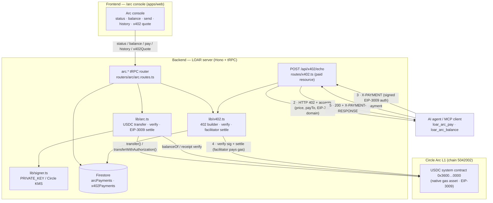

# LOAR × ENS · Arc · Google Cloud — ETHGlobal NYC 2026

One thesis, three sponsors: **the autonomous agent economy.** LOAR's AI agents get
a **name** (ENS), the ability to **pay each other** (Arc/USDC via x402), and
**discoverability + reputation** (Google BigQuery over ERC-8004). `x402` +
`ERC-8004` are the shared rails. Companion to the Uniswap submission
([ethglobal-nyc-2026-uniswap.md](./ethglobal-nyc-2026-uniswap.md)).

| Sponsor                | Track(s)                                                 | What we built                                                                                     |
| ---------------------- | -------------------------------------------------------- | ------------------------------------------------------------------------------------------------- |
| **ENS** ($20k)         | AI-Agent Integration · Creative · Integrate · Continuity | Resolution + ENSIP-25/26 agent cards + **CCIP-Read offchain subname fleet** (`*.agents.loar.eth`) |
| **Arc** ($15k)         | Agentic Economy · Continuity                             | **USDC agent-to-agent payments** + **x402** pay-per-call settled on Arc                           |
| **Google Cloud** ($5k) | On-Chain Agent Economy                                   | **BigQuery over ERC-8004** registries (mainnet) + reputation ranking + x402-agent flagging        |

---

## ENS — agent identity

| Piece                                               | File                                                                                   |
| --------------------------------------------------- | -------------------------------------------------------------------------------------- |
| Resolution + ENSIP-25/26 agent cards                | [lib/ens.ts](../apps/server/src/lib/ens.ts)                                            |
| Offchain agent subname registry                     | [lib/ens-agent-registry.ts](../apps/server/src/lib/ens-agent-registry.ts)              |
| Resolver helpers + **CCIP-Read gateway** (EIP-3668) | [routes/ens.ts](../apps/server/src/routes/ens.ts)                                      |
| CCIP-Read resolver contract (ENSIP-10)              | [contracts/.../LoarAgentResolver.sol](../apps/contracts/src/ens/LoarAgentResolver.sol) |
| tRPC `ens.*`                                        | [routers/ens/ens.routes.ts](../apps/server/src/routers/ens/ens.routes.ts)              |
| MCP tools                                           | `loar_ens_resolve`, `loar_ens_agent_card`, `loar_ens_claim_agent_subname`              |

- **Real ENS code, not Rainbowkit.** Forward/reverse (forward-verified) + text
  records + ENSIP-26 agent endpoints, live against mainnet.
- **Agent fleets via CCIP-Read.** `LoarAgentResolver.sol` is the resolver for
  `agents.loar.eth`; any subname defers to our gateway
  (`GET /api/ens/ccip/{sender}/{data}.json`), which serves the agent's address +
  ENSIP-26 records from Firestore and **signs** the answer
  (`keccak256(0x1900 ‖ resolver ‖ expires ‖ keccak(request) ‖ keccak(result))`),
  verified on-chain. A whole agent fleet gets gasless, verifiable ENS names.
- **No hard-coded values** — every name resolves from the registry / live ENS.
- **Verified live:** `apps/server/scripts/test-ens-live.ts` (5/5 — resolves
  `vitalik.eth` ↔ address against mainnet).

**One-time wiring (ops):** deploy `LoarAgentResolver` with the gateway URL +
the platform signer address; set it as the resolver for `agents.loar.eth`.

## Arc — agent payments (USDC + x402)

| Piece                            | File                                                                        |
| -------------------------------- | --------------------------------------------------------------------------- |
| Arc chain + USDC transfer/verify | [lib/arc.ts](../apps/server/src/lib/arc.ts)                                 |
| x402 facilitator (402 + settle)  | [lib/x402.ts](../apps/server/src/lib/x402.ts)                               |
| x402-gated demo endpoint         | [routes/x402.ts](../apps/server/src/routes/x402.ts) — `POST /api/x402/echo` |
| tRPC `arc.*`                     | [routers/arc/arc.routes.ts](../apps/server/src/routers/arc/arc.routes.ts)   |
| **Frontend** (Arc console)       | [web/.../arc.tsx](../apps/web/src/routes/arc.tsx) (`/arc`)                  |
| MCP tools                        | `loar_arc_pay`, `loar_arc_balance`                                          |

> **Continuity Track:** Arc is added to LOAR, a live AI-video / on-chain story
> platform that already exists (commerce + wallet + treasury). Arc becomes the
> USDC settlement layer for its agent economy — net-new integration, existing
> product. Frontend **and** backend are both live; the diagram is below.

- **Agent-to-agent USDC** on Arc (chain `5042002`, native USDC at `0x3600…0000`).
  Payment verification handles **both** ways USDC moves on Arc: ERC-20 `transfer()`
  (6-dec `Transfer` on `0x3600…`) **and** native value sends (`Transfer` on the
  EIP-7708 emitter `0xffff…fe`, 18-dec ÷10¹²) — the #1 Arc integration footgun.
- **Canonical x402 (HTTP 402), "exact" EVM scheme:** an agent hits a paid resource
  → `402` + `accepts` (price, payTo, asset, **EIP-712 domain in `extra`**) → the
  agent **signs an EIP-3009 `TransferWithAuthorization` off-chain** (never
  broadcasts) → retries with `X-PAYMENT` (base64 `{signature, authorization}`) →
  the **facilitator (our server) verifies the signature and submits
  `transferWithAuthorization`, paying gas** → returns `X-PAYMENT-RESPONSE`.
  Confirmed live: Arc USDC implements EIP-3009 (`authorizationState` present).
- **Tested:** x402 encode/handshake unit (3/3) **+ live EIP-3009 verify against
  Arc's real USDC domain** (6/6, [`scripts/test-arc-x402-live.ts`](../apps/server/scripts/test-arc-x402-live.ts)):
  a genuine EIP-712 signature verifies and over-charge / wrong-recipient are rejected.

### Architecture diagram



**Two settlement paths, one asset:** direct USDC transfers (`arc.pay`, used by the
`/arc` console and `loar_arc_pay`) and the canonical x402 facilitator flow
(agent signs off-chain, server broadcasts `transferWithAuthorization`). Both
land as real USDC movements on Arc; both are idempotent against replay (Firestore
ledger + on-chain EIP-3009 nonce).

## Google Cloud — ERC-8004 reputation via BigQuery

| Piece                              | File                                                                                                              |
| ---------------------------------- | ----------------------------------------------------------------------------------------------------------------- |
| BigQuery client + ERC-8004 queries | [lib/bigquery-erc8004.ts](../apps/server/src/lib/bigquery-erc8004.ts)                                             |
| tRPC `agentRegistry.*`             | [routers/agentRegistry/agentRegistry.routes.ts](../apps/server/src/routers/agentRegistry/agentRegistry.routes.ts) |
| Frontend dashboard                 | [web/.../agents.discover.tsx](../apps/web/src/routes/agents.discover.tsx) (`/agents/discover`)                    |
| MCP tools                          | `loar_agent_rank`, `loar_agent_reputation`                                                                        |

- **BigQuery is the core**, as required: queries `bigquery-public-data.crypto_ethereum.logs`
  filtered to the **ERC-8004 mainnet** registries (Identity `0x8004A169…`, Reputation
  `0x8004BAa1…`) **and the exact event topic0** (`NewFeedback`, `Registered`) — so it
  counts real feedback per `agentId` (topics[1]), not every emitted log. (Live since
  the ERC-8004 mainnet launch; ValidationRegistry has no canonical mainnet deploy yet.)
- **Frontend** at `/agents/discover` pairs the BigQuery backend with a lightweight
  UI (ENS resolver + leaderboard + **x402-agent flagging**).
- Auth reuses the existing GCP service account (no new dependency — uses
  `google-auth-library` + the BigQuery REST API).

---

## Configuration

All gated on env — unset = clean "not configured" responses, app unaffected.
See [.env.example](../.env.example) for the full annotated list. Quick map:

```
ENS:    (RPC_URL_MAINNET optional)  ENS_AGENT_PARENT  PUBLIC_BASE_URL
Arc:    ARC_RPC_URL  X402_PAY_TO  X402_PRICE_USDC   (signing via PRIVATE_KEY/KMS)
GCloud: GCP_PROJECT_ID  GCP_SERVICE_ACCOUNT_JSON  ERC8004_*_REGISTRY
```

## Producing the testnet transactions (capture-ready)

Each pillar has a one-command demo script. Each runs against live infra and
exits with a clear "needs X" message until its creds/funds are present, then
broadcasts/queries and prints the hash/output.

```bash
cd apps/server

# Arc — direct USDC payment + canonical x402 EIP-3009 settle.
#   Needs: PRIVATE_KEY (auto-generated, wired) funded with Arc testnet USDC.
#   Faucet: https://faucet.circle.com → Arc Testnet
#   Relayer to fund: 0xbb5d1b3178dED12Dbfab41edc697F6c8279df8f6
npx tsx scripts/arc-demo.ts

# Uniswap — real Sepolia ETH→$LOAR swap via Trading API + Circle DCW.
#   Needs: CIRCLE_API_KEY/ENTITY_SECRET/WALLET_SET_ID + a Sepolia-funded Circle wallet
#   (the script prints the wallet address to fund on first run).
npx tsx scripts/uniswap-demo.ts

# Google Cloud — live ERC-8004 ranking over Ethereum mainnet via BigQuery.
#   Needs: GCP_PROJECT_ID + a service account with the BigQuery Job User role.
npx tsx scripts/bigquery-demo.ts

# ENS — deploy the (already-compiled) CCIP-Read resolver to Sepolia.
#   Needs: a Sepolia-funded key. forge is installed.
cd ../contracts
forge create src/ens/LoarAgentResolver.sol:LoarAgentResolver \
  --rpc-url "$RPC_URL" --private-key 0x$PRIVATE_KEY \
  --constructor-args '["https://loar.fun/api/ens/ccip/{sender}/{data}.json"]' <signer-address>
```

## Arc Continuity Track — qualification checklist

> _Extend the Arc Ecosystem — add a working Arc integration to an existing project._

| Requirement                          | Status | Where                                                                                                               |
| ------------------------------------ | ------ | ------------------------------------------------------------------------------------------------------------------- |
| Existing project (founder/prior MVP) | ✅     | LOAR — live AI-video + on-chain story platform (this monorepo); Arc is a net-new integration                        |
| **Working backend**                  | ✅     | `lib/arc.ts`, `lib/x402.ts`, `routes/x402.ts`, `routers/arc/arc.routes.ts` — live, typechecks                       |
| **Working frontend**                 | ✅     | `/arc` console ([web/.../arc.tsx](../apps/web/src/routes/arc.tsx)) — status · balance · send · history · x402 quote |
| **Architecture diagram**             | ✅     | mermaid diagram in the Arc section above                                                                            |
| USDC payment flow on Arc             | ✅     | `arc.pay` (direct transfer) + x402 EIP-3009 settle (`/api/x402/echo`)                                               |
| Agentic economic payments            | ✅     | MCP tools `loar_arc_pay` / `loar_arc_balance` + x402 pay-per-call (agent settles in USDC)                           |
| Link to repo                         | ✅     | this GitHub repo                                                                                                    |
| Demo video + presentation            | ⏳     | record against `scripts/arc-demo.ts` + the `/arc` UI (see capture steps above)                                      |

## Status

- ✅ All server code typechecks (`tsc -b`); MCP + web typecheck (incl. new `/arc` page).
- ✅ Verified live: ENS resolution (mainnet, 5/5), Arc EIP-3009 support + canonical
  x402 signature verify against the real USDC domain (6/6). x402 encoding unit-tested.
- ✅ `LoarAgentResolver.sol` compiles (forge): 10,118-byte bytecode + ABI.
- ⏳ Live on-chain txs need creds + funds (the commands above): Arc-funded relayer,
  Circle creds + Sepolia-funded wallet, a GCP/BigQuery project, and the resolver
  deploy + `agents.loar.eth` resolver set for CCIP subnames.
- ⏳ Per-sponsor: demo video + booth presentation (ENS, Sunday AM).
